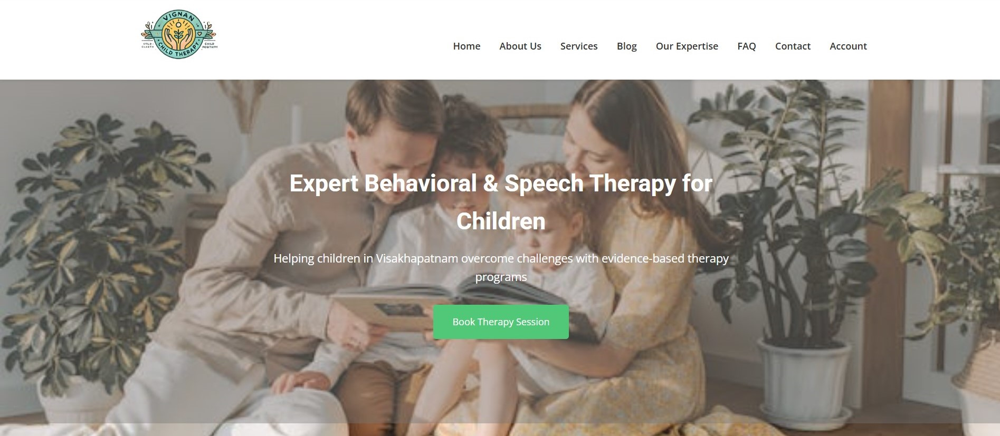

# Child Therapy Centre

A 24-hour Hackathon project submitted in fulfilment of requirements for the award learning degree of  
**Bachelor of Technology in Computer Science and Engineering**

**Under the guidance of**  
ANITS College Hackathon Coordinators  
Sanghivalasa, Visakhapatnam

---

## Problem Statement
**To create an SEO-friendly website for 'Child Therapy Centre' optimized for keyword ranking (Behavioural Therapy, Speech Therapy) in top 10 SERP positions.**

### Description
Here , we have to make a responsive website which should be based on SEO(Search Engine Optimization).Also, we have to use the keywords like:-Behavioural Therapy, Speech Therapy to optimize our website so that search engines like Googles will recommend our website in  Top 10  Priority and our website should gain traffic and gain more reach to build trust with the users.
As we know 72%  of the users across world-wide never go in the second page of SERP(SEARCH ENGINE RESULT PAGE) By analysing the competitors performance we have to make the website in such a way so that it could perform more than that of market competitors.
This website should include good UI/UX with smooth custom colour composition with high quality human readable content.

---

## Technology Stack


---

## Project Structure
```bash
/Children-therapy-centre
├── /Behavioral-therapy
│   ├── index.html
│   ├── style.css
│   └── script.js
├── /speech-therapy
│   ├── index1.html
│   ├── style1.css
│   └── script1.js
├── /images
├── index.html          # Homepage
├── about.html          # About Us
├── services.html       # Services
├── blog.html           # Blog
├── contact.html        # Contact Us
├── expertise.html      # Our Expertise
├── faq.html            # FAQ
├── styles.css          # Shared CSS
├── book.html           # Appointment Form
├── submit.php          # Form Handler
└── script.js           # Shared JavaScript
```
## 📖 Overview  
A responsive website designed to provide accessible child therapy services in Visakhapatnam, specializing in:  
- **Behavioral Therapy**  
- **Speech Therapy**  
- Parent-child interaction programs  
- Early intervention support  

**SEO Focus**: Optimized for keywords like "Behavioral therapy", "Speech therapy", and "Child development".

---

## 🚀 Features  
1. **SEO-Optimized Content**  
   - Keyword-rich meta descriptions and headers  
   - Schema markup for local business visibility  

2. **Responsive Design**  
   - Mobile-friendly navigation with hamburger menu  
   - Adaptive grids for different screen sizes  

3. **Therapy Services**  
   - Detailed service pages with therapist profiles  
   - Appointment booking system (`book.html` + PHP backend)  

4. **Accessibility**  
   - Alt text for all images  
   - ARIA labels for screen readers  

5. **Interactive Elements**  
   - Gradient animations on service cards  
   - Swiper.js testimonials carousel  

---
---

## 🛠️ Installation  
1. Clone the repository: 
       git clone https://github.com/yourusername/child-therapy-centre.git  
2. Set up XAMPP server
3. Place files in htdocs folder
4. Start Apache/MySQL modules
5. Configure PHP contact form:
   // Update in submit.php  
       $to = "your@email.com";
6. Run locally:
       http://localhost/children-therapy-centre

---
## 📱 Usage
Homepage:
  - View featured therapies
  - Book appointments via sticky CTA button
Service Pages:
  - Explore detailed therapy descriptions
  - View therapist qualifications
Blog:
  - Access child development resources
  - Read success stories
    
---

## 📸 Screenshots
  
 
 
 
---
---

## 🤝 Contributing
1. Fork the repository-
2. Create a feature branch:
      git checkout -b feature/new-feature  
3. Add your changes with SEO improvements or UI enhancements
4. Submit a pull request

## Guidelines:
  - Maintain keyword density (2-3%)
  - Ensure mobile responsiveness
  - Validate schema markup changes

---

## 📄 License
This project is licensed under the Apache License 2.0 - see LICENSE.md for details.
